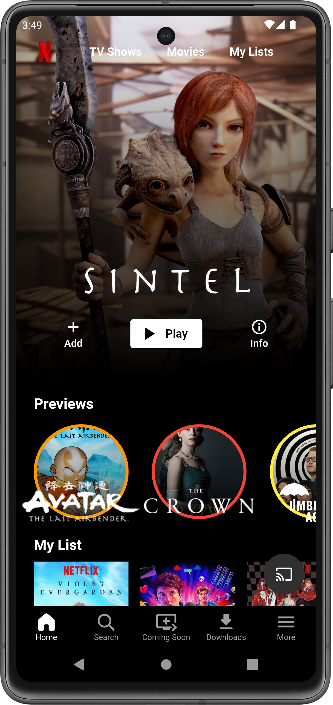
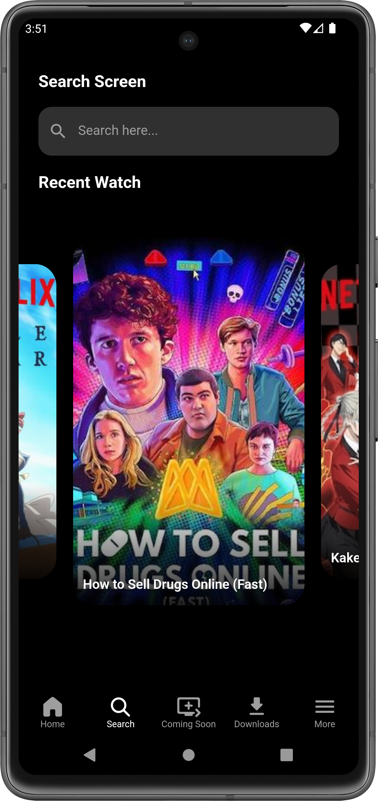

# Netflix Clone UI in Flutter

This project is a Netflix clone UI built using Flutter. It features a sleek and modern design inspired by Netflix, with various functionalities such as video playback, state management, and parallax animations.

## Features

- **Beautiful UI**: Replicates the Netflix user interface with a modern and clean design.
- **State Management**: Uses `flutter_bloc` for managing the state of the application, especially for the AppBar.
- **Video Playback**: Integrates the `video_player` package for seamless video playback.
- **Custom Icons**: Utilizes `fluentui_system_icons` for a rich set of UI icons.
- **Parallax Animation**: Implements parallax effect for animations using `ParallaxFlowDelegate`.

## Packages Used

- [`flutter_bloc`](https://pub.dev/packages/flutter_bloc)
- [`video_player`](https://pub.dev/packages/video_player)
- [`fluentui_system_icons`](https://pub.dev/packages/fluentui_system_icons)

## Screenshots

| Home Screen                             | Home Screen                               | Search Screen                             |
|-----------------------------------------|-------------------------------------------|-------------------------------------------|
|     |     |    |

## State Management

The state of the AppBar and other components is managed using the `flutter_bloc` package. This ensures a scalable and maintainable architecture for managing state.

## Parallax Animation

The parallax effect is achieved using a custom `ParallaxFlowDelegate`. This creates a smooth and visually appealing animation for the UI components.

## Enjoy coding! 🎉
